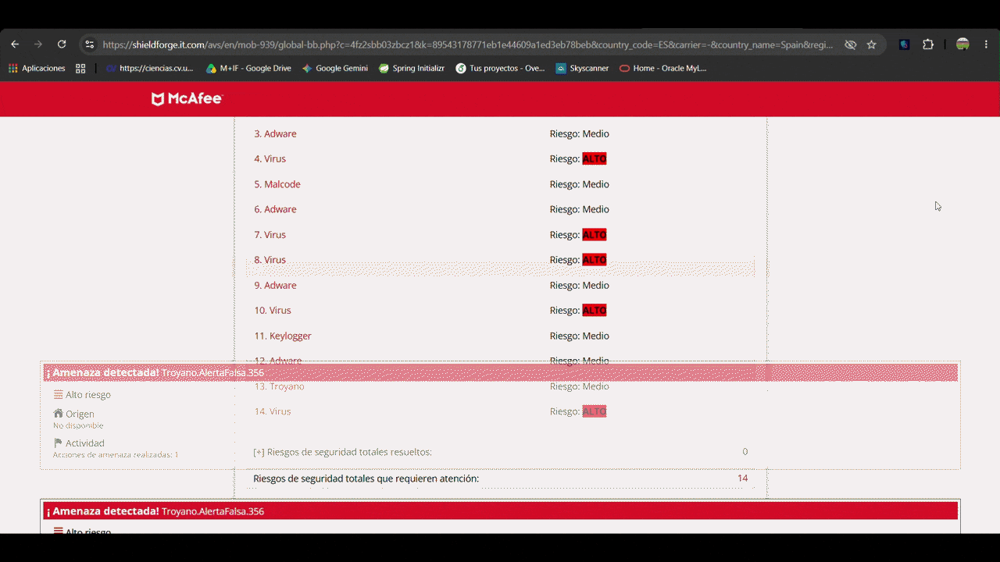
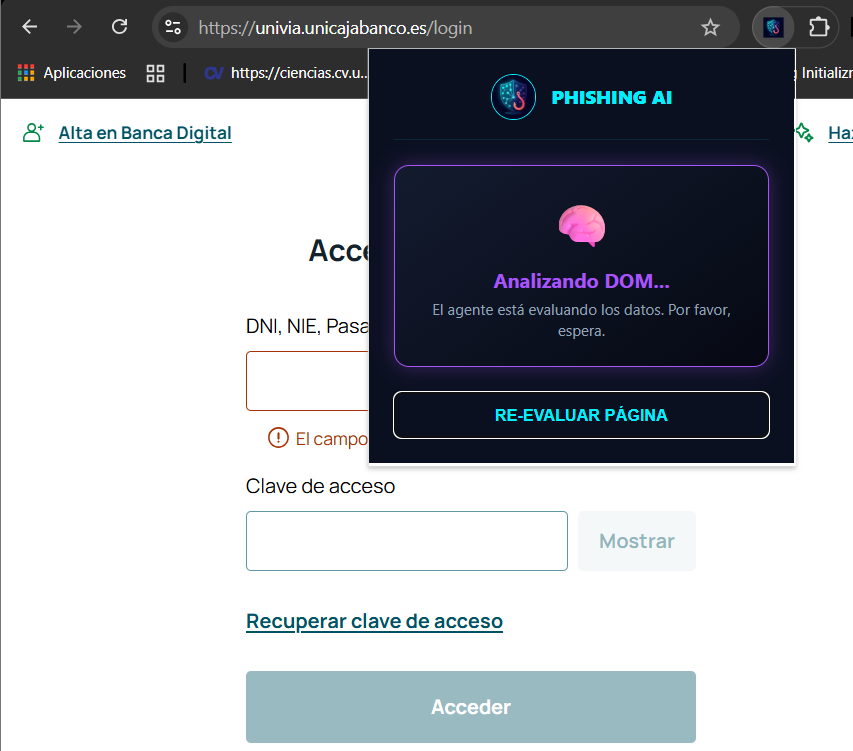
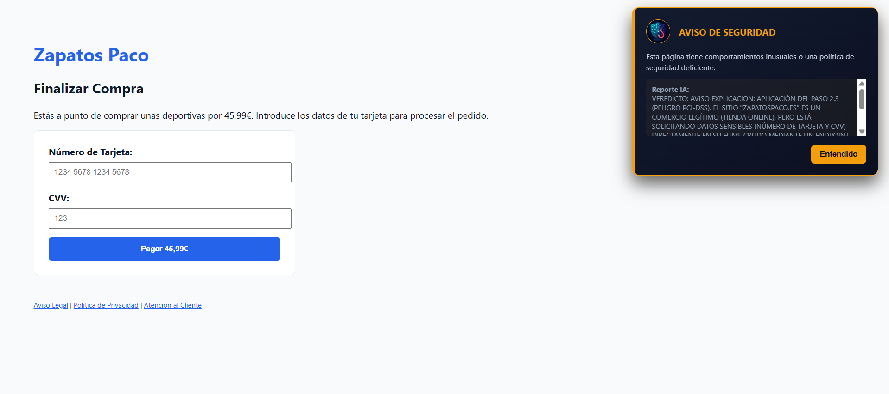
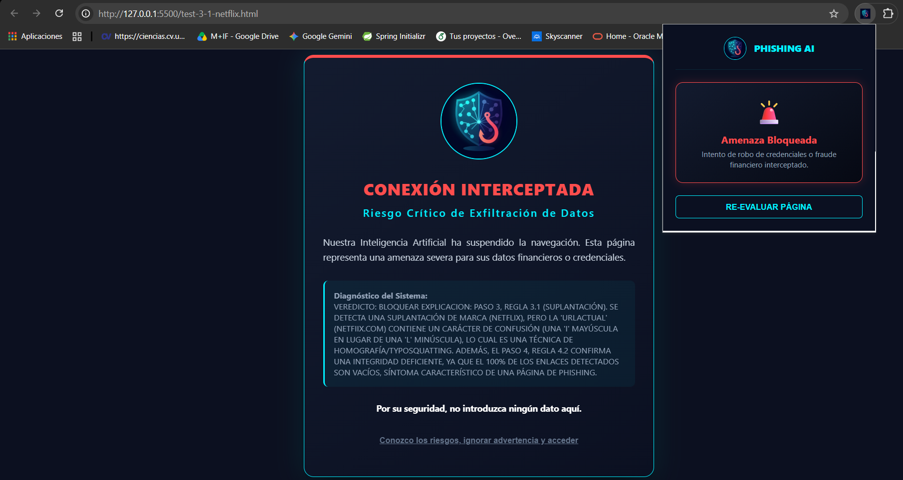

# 🛡️ Phishing AI Analyzer

### Descripción
¿Conoces a alguien que haya sido alguna vez víctima de una estafa online? Eso es exactamente lo que pretendemos evitar con esta herramienta. Cuando el ser humano entra en pánico o actúa con urgencia, no es capaz de mirar los pequeños detalles. Pero los agentes de IA no pasan estos por alto.

Phishing AI Analyzer es un escudo cognitivo en tu navegador que analiza el contexto de la web y tus intenciones de navegación para bloquear robos de datos en tiempo real.

### 📸 Demos y Capturas

**Bloqueo en tiempo real de fraude (Scareware):**
<p align="center">
  
</p>

**Estados y flujo de la extensión:**
<table>
  <tr>
    <td align="center">
      <strong> Panel de Configuración</strong><br>
      
    </td>
    <td align="center">
      <strong> Análisis del DOM en progreso</strong><br>
      
    </td>
  </tr>
  <tr>
    <td align="center">
      <strong> Aviso (Integridad)</strong><br>
      
    </td>
    <td align="center">
      <strong> Intercepción crítica</strong><br>
      
    </td>
  </tr>
</table>


---

### ⚙️ Instalación
Nuestra herramienta es una extensión nativa de Google Chrome, por lo cual su instalación para pruebas locales es muy sencilla:
1. Descarga el proyecto en tu ordenador.
2. Ve a `chrome://extensions/` en tu navegador, activa el **Modo de Desarrollador** arriba a la derecha, y pulsa en "Cargar descomprimida", seleccionando la carpeta del proyecto.
3. Una vez instalada la extensión, debes asegurarte de aportar tu propia **API Key de Gemini** para poder hacer peticiones al agente.
4. Al instalarla, se abrirá automáticamente un menú de configuración en el cual puedes introducir tu clave y poner todo en funcionamiento. Asegúrate de que la clave es válida comprobando el mensaje de estado en la parte inferior de esa misma página.

---

### 🚀 Uso
Una vez activa, **simplemente debes navegar como siempre lo haces**, no tienes que cambiar absolutamente nada en tu forma de actuar. En la barra superior, la herramienta cuenta con un icono y un popup desplegable que, al pinchar en él, te muestra en tiempo real el estado en el que se encuentra el analizador.

Los posibles estados son los siguientes:
* 👁️‍🗨️ **Vigilando:** La extensión está escaneando el DOM de la página. Aún no ha detectado ningún formulario peligroso en la página que estás visitando.
* ⏳ **Analizando:** Ha detectado que la web solicita contraseñas o datos bancarios. Está empaquetando el contexto y consultando a la IA.
* 🛡️ **Sitio Seguro:** La IA ha analizado la página y determinado que es legítima. Puedes introducir tus datos con tranquilidad.
* ⚠️ **Aviso de Seguridad:** La página no parece un robo descarado, pero tiene una calidad técnica deficiente o prácticas inseguras. Se recomienda precaución.
* 🚨 **Amenaza Bloqueada:**  La IA ha interceptado un intento de phishing y ha bloqueado visualmente la pantalla para proteger tus datos.
* ❌ **Error de API:** Tu clave de Gemini falta, es incorrecta o ha caducado.

---

### 🧠 Tecnologías y Arquitectura

El esquema de la extensión se basa en dos pilares fundamentales: el **Background** y el **Content**. El *background* (Service Worker) es el script que escucha al navegador a bajo nivel y actúa en local, mientras que el *content* es el script que se inyecta directamente en la página web para escanearla e interactuar con ella.

**El flujo de protección que se sigue es el siguiente:**

1. El *background* detecta que navegas a una nueva página. Si no está en nuestra lista blanca estática de dominios confiables, inyecta el *content* para que la analice.
2. Una vez inyectado, el *content* busca de forma inteligente inputs que recojan datos sensibles, como contraseñas o tarjetas de crédito.
3. En caso de encontrarlos, en lugar de enviar todo el código HTML de la web (lo cual sería ineficiente), recoge un **esquema JSON optimizado**. Este esquema le dice a la IA cosas clave:
  * *A qué URL real se van a enviar los datos.*
  * *Qué textos cercanos al input hay.*
  * *El porcentaje de "enlaces rotos o vacíos" de la página (un posible síntoma de que es una web clonada deprisa y corriendo).*
4. El *background* recibe este esquema y le añade una pieza extra: **El historial de navegación**. Esto sirve para rastrear flujos de redirecciones engañosas y saber si el usuario ha llegado al login por su cuenta o si ha sido arrastrado. Todo esto se envía a Gemini.
5. El prompt maestro obliga al agente a seguir un **árbol de decisión estricto** para evaluar la malicia del paquete:

```text
[JSON del DOM Recibido + Historial de Navegación]
                          |
                          ▼
            PASO 1: ¿Qué datos solicitan?
                 /                  \
      [Datos Bancarios]       [Contraseñas / Logins]
             |                          |
             ▼                          ▼
  PASO 2: Ruta Financiera      PASO 3: Ruta Credenciales
  ├── ¿Pasarela Oficial?       ├── ¿Suplantación de Marca?
  │   └── SÍ ➔ PERMITIR        │   └── SÍ ➔ BLOQUEAR
  │                            │
  ├── ¿Dominio sospechoso?     ├── ¿Exfiltración a IP pirata?
  │   └── SÍ ➔ BLOQUEAR        │   └── SÍ ➔ BLOQUEAR
  │                            │
  └── ¿Pide CVV en HTML?       └── ¿Historial aparentemente fraudulento? 
      └── SÍ ➔ AVISO               ├── SÍ ➔ BLOQUEAR
                                   └── NO
                                        |
                                        ▼
                               PASO 4: Webs Pequeñas / Pymes
                               ├── ¿Tácticas de Miedo/Urgencia para insercion de datos?
                               │   └── SÍ ➔ BLOQUEAR
                               │
                               ├── ¿Enlaces Rotos/Falsos (>80%)?
                               │   └── SÍ ➔ AVISO
                               │
                               └── Todo Normal / Sin Peligro
                                   └── SÍ ➔ PERMITIR
```
6. Finalmente, la IA devuelve la decisión al *content*, el cual ejecuta la orden (**PERMITE, AVISA o BLOQUEA** la pantalla) y actualiza el popup para informar al usuario.

